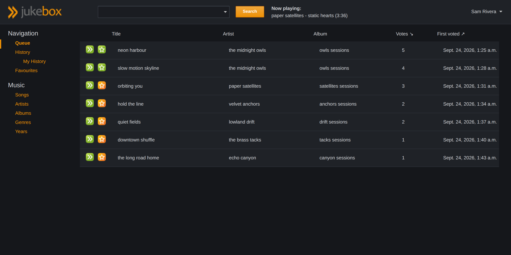
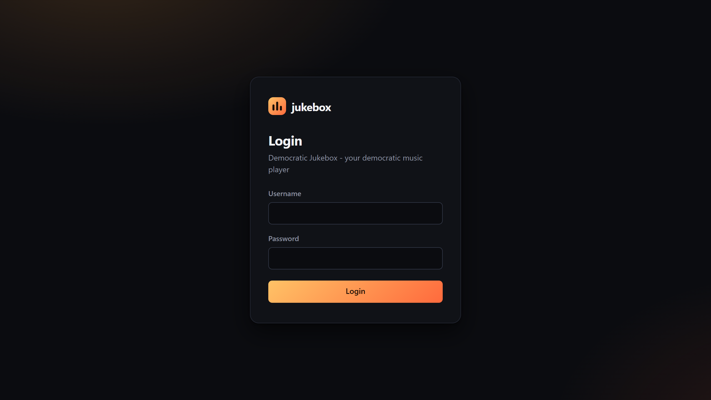

# Democratic Jukebox

**Let everyone in the room decide what plays next.**

Jukebox is a self-hosted music player for offices, shared flats and parties. It indexes your MP3 library
and gives everyone a web interface to search it and vote for songs. The more votes a song gets, the
sooner it plays. When the queue runs empty the jukebox keeps going and picks music that matches the
taste of whoever is currently online.



## Features

- **Voting queue**: the most-voted song plays next; ties go to whoever voted first
- **Smart autoplay**: with an empty queue it picks artists from the favourites and voting history of
  the people who are online
- **Search** by title, artist and album, with filters such as `artist:(the beatles) year:1965`
- **Favourites and history**, both shared and personal
- **Dark mode** by default, with a light theme one click away
- **Local accounts** with username and password, plus optional login through GitHub, Twitter or
  Facebook
- **REST API** for your own clients, see the [API reference](jukebox/jukebox_core/docs/API.rst)
- **RSS feed** of the next song at `/feed/`
- English and German interface

## Requirements

- Python 3.10 or newer
- A playback plugin to actually play the music (see [Playback](#playback))

## Quick start

```sh
python3 -m venv ~/jukebox-env
source ~/jukebox-env/bin/activate
pip install git+https://github.com/Jgreenwood5565/jukebox.git

jukebox jukebox_setup                             # admin contact, host names, optional social login
jukebox migrate                                   # create the database
jukebox jukebox_adduser yourname --admin          # create your login
jukebox jukebox_index --path=/path/to/your/music  # add your library
jukebox runserver 0.0.0.0:8000
```

Open `http://<your host>:8000`, log in and start voting. Create an account for everyone else with
`jukebox jukebox_adduser <username>`, or turn on social login so people can sign in with an existing
account.



## Docker and Raspberry Pi

The repository includes a `Dockerfile` and `docker-compose.yml`. The image runs on regular PCs
(amd64) and on a Raspberry Pi 3, 4 or 5 with a **64-bit** OS (arm64). On the Pi:

```sh
# install Docker (skip if it is already installed), then log out and back in
curl -fsSL https://get.docker.com | sh
sudo usermod -aG docker $USER

git clone https://github.com/Jgreenwood5565/jukebox.git
cd jukebox
cp .env.example .env        # set the Pi's IP address and your music folder
docker compose up -d --build

docker compose exec jukebox jukebox jukebox_adduser yourname --admin
docker compose exec jukebox jukebox jukebox_index --path=/music
```

Then open `http://<pi ip>:8000`. The database and secret key are stored in the `jukebox-data`
volume. The music folder is mounted read-only, and the container runs as user id 1000, which is the
default `pi` user, so the files need to be readable by that user. To update, run `git pull` and then
`docker compose up -d --build`; migrations run automatically on start.

## Configuration

Everything is stored in `~/.jukebox`: the SQLite database, the generated secret key and
`settings_local.py`, which `jukebox_setup` writes for you. Set `JUKEBOX_HOME` to use a different
directory. `settings_local.py` can override any Django setting; see
[`settings_local.example.py`](jukebox/settings_local.example.py).

| Setting / environment variable | Default | Purpose |
| --- | --- | --- |
| `ALLOWED_HOSTS` / `JUKEBOX_ALLOWED_HOSTS` | `localhost,127.0.0.1` | Host names used to open the jukebox |
| `DEBUG` / `JUKEBOX_DEBUG` | off | Django debug mode, never enable it on a shared network |
| `SECRET_KEY` / `JUKEBOX_SECRET_KEY` | generated | Signs sessions, created on first start if unset |
| `JUKEBOX_LOCAL_LOGIN` | on | Username/password login on the login page |
| `JUKEBOX_DEFAULT_THEME` | `dark` | `dark` or `light`, users can switch in the account menu |
| `JUKEBOX_LOGIN_ATTEMPTS` | `10` | Failed logins per user and IP before a 15 minute lockout |
| `SESSION_TTL` | `300` | Seconds without activity before a user no longer counts as online |

### Social login

`jukebox_setup` asks for the app ID and secret of each provider you want. When you register the app
with the provider, use `http(s)://<your host>/complete/<provider>/` as the callback URL, for example
`/complete/github/`. The underlying library is
[python-social-auth](https://python-social-auth.readthedocs.io/), which supports many more providers.

### Running it properly

The built-in server is fine for a party. For anything longer-lived, use a WSGI server and put a
reverse proxy with HTTPS in front of it:

```sh
pip install gunicorn
gunicorn jukebox.wsgi:application --bind 127.0.0.1:8000
```

Static files are served by the application itself through WhiteNoise, so there is no `collectstatic`
step.

## Playback

The web interface only manages the queue. A playback plugin pulls the next song and plays it:

- [jukebox_mpg123](https://github.com/lociii/jukebox_mpg123) plays through `mpg123` on the jukebox
  machine
- [jukebox_shout](https://github.com/lociii/jukebox_shout) streams to a Shoutcast/Icecast server
- [jukebox_live_indexer](https://github.com/lociii/jukebox_live_indexer) watches your library and
  indexes new files

Installed packages whose names start with `jukebox_` are loaded automatically. These plugins were
written for the Python 2 version and need a port to Python 3. The API they use, `api.songs().getNextSong()`,
`api.players()` and `FileIndexer`, is unchanged.

## Upgrading from 0.4

Version 0.5 moves from South to Django migrations and from django-social-auth to python-social-auth.
Your existing `settings_local.py` keeps working. Back up `~/.jukebox/db.sqlite`, install the new
version and run:

```sh
jukebox jukebox_upgrade
```

This converts the database and keeps existing social logins linked to their accounts, so favourites
and history are preserved. Timestamps are now stored in UTC, so older entries appear shifted by your UTC
offset.

## Development

```sh
git clone https://github.com/Jgreenwood5565/jukebox.git
cd jukebox
python3 -m venv .venv && source .venv/bin/activate
pip install -e ".[dev]"

./manage.py test                          # full test suite
ruff check . && ruff format --check .     # lint
```

`./manage.py` works the same as the installed `jukebox` command. CI runs the same checks on every push.

## Credits

Democratic Jukebox was created by **[Jens Nistler](https://github.com/lociii)**. The original project
lives at [lociii/jukebox](https://github.com/lociii/jukebox). He has since marked it unmaintained,
and this fork continues it with a modernized code base. All credit for the idea, the design and the
original implementation goes to him.

Contributors to the original project:

- [Steffen Zieger](https://github.com/saz)
- [Jonas Baumann](https://github.com/jone)
- [Gabriel Duman](https://github.com/gabber7)
- [Peter Hoffmann](https://github.com/hoffmann)
- [Amir H. Hajizamani](https://github.com/amirhhz)
- [Mithun Shitole](https://github.com/imithun)
- [Luan Fonseca de Farias](https://github.com/luanfonceca) (Brazilian Portuguese translation, upstream)
- [Mounir Messelmeni](https://github.com/MounirMesselmeni) (French translation, upstream)

See [CHANGES.txt](CHANGES.txt) for the release history.

## License

MIT License, see [LICENSE.rst](LICENSE.rst). Copyright © Jens Nistler and contributors.
